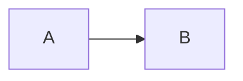

# Obsidian markdown syntax

Read this when generating or editing markdown destined for an Obsidian vault. Obsidian is mostly CommonMark + GFM with a handful of extensions. Skip this file when working on plain markdown for non-Obsidian targets.

## Standard CommonMark / GFM

| Construct           | Syntax                                                       |   |   |   |   |   |   |
|---------------------|--------------------------------------------------------------|---|---|---|---|---|---|
| H1–H6               | `# H1` … `###### H6` (space required after `#`)              |   |   |   |   |   |   |
| Bold                | `**bold**` or `__bold__`                                     |   |   |   |   |   |   |
| Italic              | `*italic*` or `_italic_`                                     |   |   |   |   |   |   |
| Strikethrough       | `~~strike~~`                                                 |   |   |   |   |   |   |
| Inline code | `` `code` `` (use longer runs to embed backticks: `` `` `code with ` inside` `` ``) |  |  |  |  |  |  |
| Code block (fenced) | <code>```lang\n…\n```</code> or <code>~~~lang\n…\n~~~</code> |   |   |   |   |   |   |
| Code block (indented) | 4 spaces or a tab, after a blank line |  |  |  |  |  |  |
| Blockquote          | `> text` (nest with `> > text`)                              |   |   |   |   |   |   |
| Unordered list      | `- item` or `* item` or `+ item`                             |   |   |   |   |   |   |
| Ordered list        | `1. item` (numbers don't have to be sequential)              |   |   |   |   |   |   |
| Task list           | `- [ ] todo` / `- [x] done`                                  |   |   |   |   |   |   |
| Horizontal rule     | `---`, `***`, or `___` on its own line                       |   |   |   |   |   |   |
| Table | `\ | col \ | col \ | ` with `\ | ---\ | ---\ | ` separator |
| Footnote            | `text[^1]` … later `[^1]: definition`                        |   |   |   |   |   |   |
| Markdown link       | `[text](url-or-path)`                                        |   |   |   |   |   |   |
| Markdown image      | ``                                        |   |   |   |   |   |   |
| Escape              | `\*` to render a literal `*`                                 |   |   |   |   |   |   |

## Obsidian extensions

### Wikilinks

```
[[Note]]                   target: Note
[[Note|Display]]           target with custom display text
[[Note#Heading]]           link to a heading
[[Note#Heading 1#Sub]]     multi-level heading
[[Note#^block-id]]         link to a block (block ids are alphanumeric+hyphen)
[[Folder/Note]]            disambiguate by path when names collide
[[#Heading]]               link to heading in the current note
[[#^block]]                link to a block in the current note
```

Wikilinks may NOT span newlines. Inside the brackets, target/heading/block/display follow the order: `target#heading-or-block|display`.

### Embeds

Prefix any wikilink with `!` to embed instead of link:

```
![[Note]]                  embed full note
![[Note#Heading]]          embed a section
![[Note#^block]]           embed a single block
![[image.png]]             embed image (jpg, png, gif, webp, svg, bmp)
![[song.mp3]]              embed audio
![[clip.mp4]]              embed video
![[doc.pdf]]               embed PDF
```

Markdown-style image links (``) also embed but are second-class in Obsidian.

### Block references

Append `^block-id` at the end of a paragraph or block to make it linkable:

```
Important paragraph here. ^key-insight

Refer to it elsewhere with [[Note#^key-insight]].
```

Block ids are arbitrary identifiers using letters, digits, and hyphens. Obsidian generates `^abcdef` style ids automatically when the user copies a block reference.

### Callouts

Callouts are blockquotes with a type marker:

```
> [!note] Optional title
> Body content.

> [!warning]+ Folded out by default
> Use `+` to expand, `-` to collapse.
```

Built-in types include `note`, `info`, `tip`, `success` / `check` / `done`, `question` / `help` / `faq`, `warning` / `caution` / `attention`, `failure` / `fail` / `missing`, `danger` / `error`, `bug`, `example`, `quote` / `cite`, `summary` / `tldr` / `abstract`, `todo`. Type names are case-insensitive.

### Highlight

```
==highlighted text==
```

### Comments

Obsidian-only inline comments stripped from preview but preserved in the file:

```
%% inline comment %%

%%
multi-line
comment
%%
```

### Tags

```
#projects/obsidian
#work
#tag1
```

Rules:
- Allowed chars after `#`: `A-Z a-z 0-9 _ - /`
- Must contain at least one non-digit character (so `#1234` is not a tag).
- Must be preceded by start-of-line or whitespace. `color#red` is not a tag.
- Tags inside fenced/inline code do not count.
- Tags inside frontmatter belong in the `tags` property as a list.

### Math

Inline: `$E = mc^2$`. Block:

```
$$
\int_0^\infty e^{-x} dx = 1
$$
```

KaTeX-flavored.

### Mermaid

````

````

Also supported as fenced code: `dataview`, `query`, `tasks` — these are plugin-specific, do not generate them in this skill.

## Things Obsidian does not support

- Setext headings (`===` / `---` underlines) render but are de-emphasized; prefer ATX (`#`).
- Reference-style links work but are rare in Obsidian vaults.
- Raw HTML mostly works, but `<script>` is sandboxed and many tags are stripped on mobile.

## Source

Regenerated knowledge based on <https://obsidian.md/help/syntax>, <https://obsidian.md/help/callouts>, <https://obsidian.md/help/embeds>, <https://obsidian.md/help/tags>. Run `scripts/refresh_docs.py` to fetch the current upstream into `references/.cache/` if something here looks stale.
